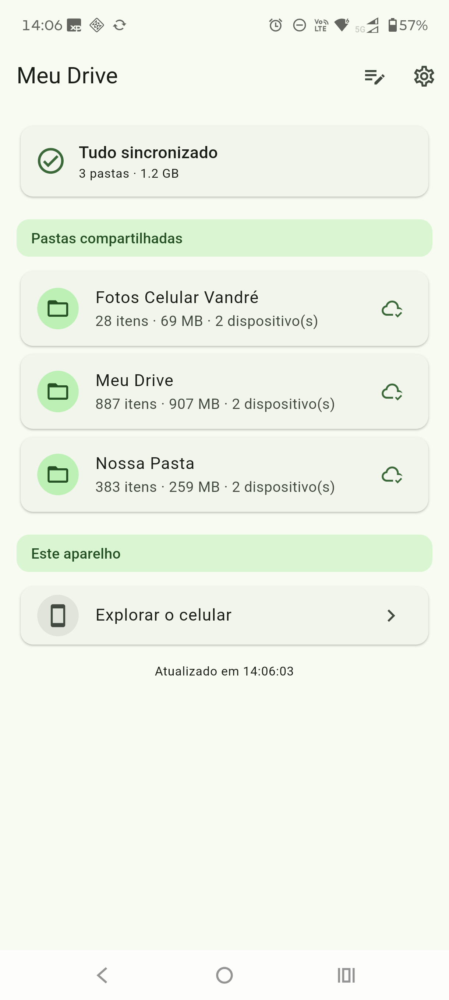
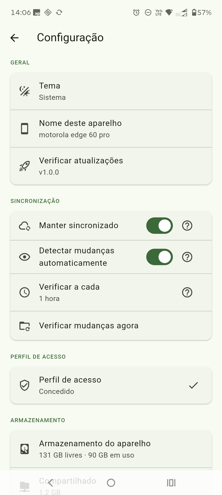

# Meu Drive

_[English](README.en.md)_

O **Meu Drive** é um aplicativo Android que funciona apenas como uma **interface
amigável** para o Syncthing: ele não implementa sincronização própria e não
reinventa nada — **todo o mérito do motor é do Syncthing**
(https://github.com/syncthing/syncthing). A intenção é esconder os conceitos
técnicos do Syncthing (device, folder ID, discovery, relay) e apresentar as
pastas com **nomes amigáveis**, estados claros de sincronização e um navegador
de arquivos comum, para que qualquer pessoa use o app como um **gerenciador de
arquivos** do dia a dia — sem precisar saber que existe um motor de
sincronização por trás.

## O que ele faz

- Mostra as pastas sincronizadas com nomes amigáveis, quantidade de itens,
  tamanho e o estado (sincronizado, sincronizando, pausado, erro).
- Navega pelos arquivos como um explorador comum: lista ou grade, miniaturas de
  fotos, visualizador em tela cheia, ordenação por nome/data/tamanho (preferências
  por pasta) e abertura de arquivos em outros apps.
- Também navega pelos arquivos do celular que **não** estão sincronizados.
- Gerencia pastas e computadores (adicionar, editar, compartilhar, remover) e o
  pareamento por **Device ID** ou **QR code**.
- Acorda e mantém a sincronização ativa sozinho, com uma notificação discreta.
- Verifica atualizações e instala novas versões dentro do próprio app.

## Capturas de tela

  
  

## Como funciona

O Syncthing é **embutido** no app (o binário oficial do motor é empacotado junto)
e executado em um serviço em primeiro plano. Não há nuvem, conta, cadastro nem
telemetria: os dados só trafegam direto entre os seus dispositivos.

## Instalando o Syncthing no computador

No computador, instale o **Syncthing oficial** para o seu sistema:
https://syncthing.net/downloads/ — o guia rápido oficial está em
https://docs.syncthing.net/intro/getting-started.html.

São poucos passos: instale, abra (ele gera a configuração e abre a interface no
navegador), adicione a pasta que você quer compartilhar e pareie com o celular
pelo **Device ID**. No Windows, quem quiser um ícone na bandeja pode usar o
**SyncTrayzor** (https://github.com/canton7/SyncTrayzor). No celular não é
preciso instalar nada além do próprio Meu Drive, que já traz o mesmo motor.

## Pareando o celular com o computador

1. No Meu Drive: **Gerenciar → Computadores → "Meu ID neste aparelho"** (mostra o
   Device ID e o QR code).
2. No Syncthing do computador: **Add Remote Device** e informe esse ID (ou leia
   o QR).
3. Compartilhe a mesma pasta dos dois lados (no Meu Drive: **Gerenciar → Pastas →
   editar → marcar o computador**).
4. Pronto: qualquer arquivo que aparecer na pasta será sincronizado.

Se os dispositivos não se encontrarem, veja a página de firewall do Syncthing:
https://docs.syncthing.net/users/firewall.html.

## Privacidade

Sem telemetria, sem analytics, sem servidores próprios. A sincronização é
ponto a ponto entre os seus dispositivos (quando necessário, o Syncthing pode
usar os serviços públicos de descoberta e relay dele).

## Licença

Este projeto é distribuído sob a **GNU General Public License v3.0** (veja o
arquivo [`LICENSE`](LICENSE)).

Créditos e licenças de terceiros:

- **Syncthing** — motor de sincronização, licenciado sob **MPL-2.0**
  (https://github.com/syncthing/syncthing). O binário do motor é redistribuído
  sem modificações.
- **Syncthing-Fork / syncthing-android** (MPL-2.0) — referência para o
  empacotamento do motor no Android e origem do binário usado no script de
  atualização.

## Aviso

Este é um projeto **não oficial** e **não é afiliado** ao projeto Syncthing. A
marca e o nome "Syncthing" pertencem aos seus autores. O Meu Drive apenas
oferece uma interface alternativa para o motor.
